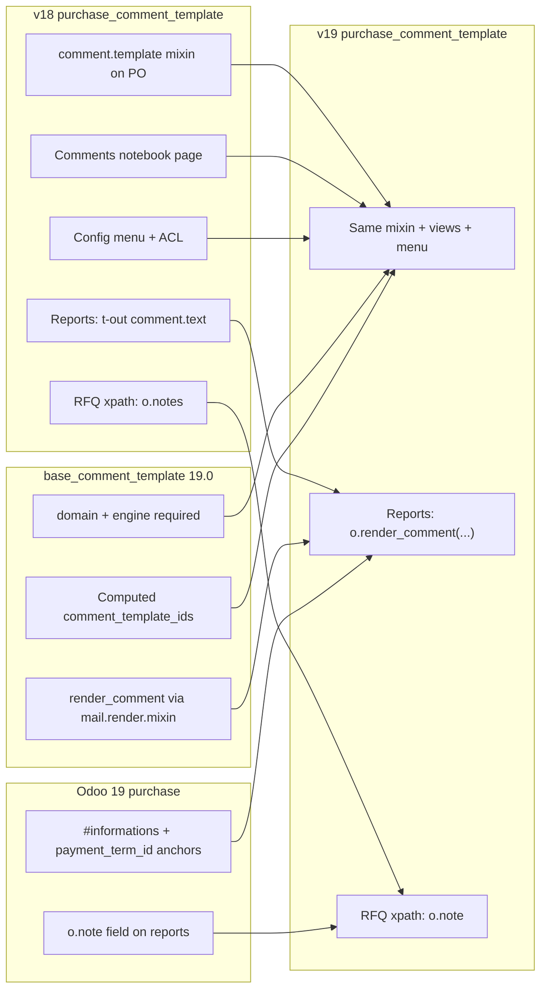

# Purchase Comment Template v18 → v19 Migration Review

## Executive summary

`purchase_comment_template` is **not** on the OCA `purchase-reporting` 19.0 branch yet. This is a **greenfield port** of the v18 module (`18.0.1.0.2`, ForgeFlow/OCA) to Odoo 19, with dependency on [`base_comment_template` 19.0](https://github.com/OCA/reporting-engine/tree/19.0/base_comment_template) from **OCA/reporting-engine**.

The Python model layer is unchanged: `purchase.order` inherits the `comment.template` mixin. The meaningful v19 work is in **report QWeb**, **test data**, and **xpath anchors** against Odoo 19 core purchase reports (`c:\Ton\Git\odoo\addons\purchase`).



---

## Dependency: base_comment_template 19.0

Source: [OCA/reporting-engine — base_comment_template @ 19.0](https://github.com/OCA/reporting-engine/tree/19.0/base_comment_template)

| Area | v18 base_comment_template | v19 base_comment_template | Impact on purchase module |
|------|---------------------------|---------------------------|---------------------------|
| Depends | `base` | `base`, `mail` | Ensure reporting-engine 19.0 on `addons_path` |
| `text` field | Char/Text | `Html` (sanitized off) | Tests still use plain strings; reports must render |
| `domain` | Optional | **Required** (`default="[]"`) | Add to test `_create_comment` |
| `engine` | N/A | **Required** (`inline_template` default) | Add to test `_create_comment` |
| `global_template` | N/A | Boolean for company-wide templates | Partner templates use `global_template=False` |
| Report output | `comment.text` direct | **`o.render_comment(comment)`** | **Must update both report inherits** |
| `comment_template_ids` | Stored M2M / editable | Computed from partner + global + domain | Partner onchange test still valid |
| `ir.model` | Manual `is_comment_template` | Auto via `_reflect_model_params` when mixin inherited | `purchase.order` flagged automatically |

Official v19 report pattern from base module README:

```xml
<t t-foreach="o.comment_template_ids.filtered(lambda x: x.position == 'before_lines')" t-as="comment_template_top">
    <div t-out="o.render_comment(comment_template_top)" />
</t>
```

---

## v18 vs Odoo 19 core purchase reports

References: `c:\Ton\Git\odoo\addons\purchase\report\`

| Anchor | v18 module xpath | Odoo 19 core | v19 action |
|--------|------------------|--------------|------------|
| PO before lines | `#informations` after | `div id="informations"` present | **Keep** |
| PO after lines | `span t-field="o.payment_term_id"` after | Present (`purchase_order_templates.xml`) | **Keep** |
| RFQ before lines | `t-set="layout_document_title"` after | Present (`purchase_quotation_templates.xml`) | **Keep** |
| RFQ after lines | `p t-field="o.notes"` after | **`p t-field="o.note"`** | **Fix xpath** |

v18 RFQ inherit used `o.notes`, which does not exist on Odoo 19 `purchase.order` (field is `note`). This was already broken or legacy; v19 must use `o.note`.

---

## Module files (unchanged vs updated)

| File | v19 action |
|------|------------|
| `models/purchase_order.py` | **Unchanged** — `_inherit = ["purchase.order", "comment.template"]` |
| `views/purchase_order_view.xml` | **Unchanged** — Comments notebook with `comment_template_ids` |
| `views/base_comment_template_view.xml` | **Unchanged** — menu under `purchase.menu_purchase_config`, domain `[('model_ids', '=', 'purchase.order')]` |
| `security/ir.model.access.csv` | **Unchanged** — purchase user read / manager CRUD on `base.comment.template` |
| `views/report_purchaseorder.xml` | **Update** — `o.render_comment(...)` instead of `.text` |
| `views/report_quotation.xml` | **Update** — `render_comment` + `o.note` xpath |
| `tests/test_purchase_order_report.py` | **Update** — `domain`, `engine`; `groups_id` → `group_ids` |
| `__manifest__.py` | Version **`19.0.1.0.0`** |

---

## Tests porting notes

1. **`_create_comment`** must include `domain="[]"` and `engine="inline_template"` (required on `base.comment.template` 19.0).
2. **`groups_id`** on `res.users` → **`group_ids`** (Odoo 19).
3. Partner linking via `partner.base_comment_template_ids` unchanged (`res_partner.py` in base module).
4. `test_comments_menu_multi_model` still sets `is_comment_template=True` on `res.users` ir.model to test multi-model menu domain — valid pattern.
5. `purchase.purchase_order_4` demo record still exists in Odoo 19 core.

---

## Verification checklist

1. Add **OCA/reporting-engine** 19.0 branch to `addons_path` (module `base_comment_template`).
2. **Install** `purchase_comment_template` with `-i purchase_comment_template --stop-after-init`.
3. **PO form** — Comments notebook shows `comment_template_ids`; partner onchange fills templates.
4. **Configuration → Document Comments** — menu opens filtered purchase templates; create defaults `models=purchase.order`.
5. **Print PO / RFQ** — before/after comment blocks appear in PDF/HTML.
6. **Run tests**: `--test-enable --test-tags /purchase_comment_template`.
7. Optional: inline template with `{{ object.name }}` in comment text to confirm `render_comment` engine path.

---

## Reference paths

- v18 source: `purchase_comment_template` (`18.0.1.0.2`)
- v19 target: `purchase_comment_template` (`19.0.1.0.0`)
- Core purchase: `c:\Ton\Git\odoo\addons\purchase`
- Base dependency: [OCA/reporting-engine @ 19.0/base_comment_template](https://github.com/OCA/reporting-engine/tree/19.0/base_comment_template)
